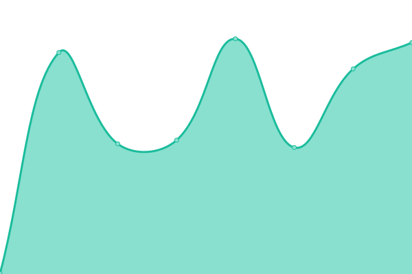

# [📈 Live Status](https://status.moomoo.me): <!--live status--> **🟧 Partial outage**

This repository contains the open-source uptime monitor and status page for [moom0o](https://status.moomoo.me), powered by [Upptime](https://github.com/upptime/upptime).

With [Upptime](https://upptime.js.org), you can get your own unlimited and free uptime monitor and status page, powered entirely by a GitHub repository. We use [Issues](https://github.com/moom0o/uptime/issues) as incident reports, [Actions](https://github.com/moom0o/uptime/actions) as uptime monitors, and [Pages](https://status.moomoo.me) for the status page.

<!--start: status pages-->
<!-- This summary is generated by Upptime (https://github.com/upptime/upptime) -->
<!-- Do not edit this manually, your changes will be overwritten -->
<!-- prettier-ignore -->
| URL | Status | History | Response Time | Uptime |
| --- | ------ | ------- | ------------- | ------ |
|  [Nitter USA](https://nitter.moomoo.me) | 🟥 Down | [nitter-usa.yml](https://github.com/moom0o/uptime/commits/HEAD/history/nitter-usa.yml) | 

 2290ms
     
 | 

<a href="https://status.moomoo.me/history/nitter-usa">98.60%</a>
    

|  [Nitter DE](https://nittereu.moomoo.me) | 🟥 Down | [nitter-de.yml](https://github.com/moom0o/uptime/commits/HEAD/history/nitter-de.yml) | 

 2780ms
     
 | 

<a href="https://status.moomoo.me/history/nitter-de">98.49%</a>
    

|  [Piped DE](https://piped.moomoo.me) | 🟩 Up | [piped-de.yml](https://github.com/moom0o/uptime/commits/HEAD/history/piped-de.yml) | 

 366ms
     
 | 

<a href="https://status.moomoo.me/history/piped-de">100.00%</a>
    

|  [Piped API DE](https://pipedapi.moomoo.me) | 🟩 Up | [piped-api-de.yml](https://github.com/moom0o/uptime/commits/HEAD/history/piped-api-de.yml) | 

 191ms
     
 | 

<a href="https://status.moomoo.me/history/piped-api-de">100.00%</a>
    

|  [Piped Proxy DE](https://pipedproxy.moomoo.me) | 🟩 Up | [piped-proxy-de.yml](https://github.com/moom0o/uptime/commits/HEAD/history/piped-proxy-de.yml) | 

 339ms
     
 | 

<a href="https://status.moomoo.me/history/piped-proxy-de">100.00%</a>
    

|  [Image Host USA](https://read-my-man.ga) | 🟩 Up | [image-host-usa.yml](https://github.com/moom0o/uptime/commits/HEAD/history/image-host-usa.yml) | 

 181ms
     
 | 

<a href="https://status.moomoo.me/history/image-host-usa">100.00%</a>
    

|  [MineTrack Site USA](https://track.read-my-man.ga) | 🟩 Up | [mine-track-site-usa.yml](https://github.com/moom0o/uptime/commits/HEAD/history/mine-track-site-usa.yml) | 

 1149ms
     
 | 

<a href="https://status.moomoo.me/history/mine-track-site-usa">100.00%</a>
    

<!--end: status pages-->

[**Visit our status website →**](https://status.moomoo.me)

## 📄 License

- Powered by: [Upptime](https://github.com/upptime/upptime)
- Code: [MIT](./LICENSE) © [moom0o](https://status.moomoo.me)
- Data in the `./history` directory: [Open Database License](https://opendatacommons.org/licenses/odbl/1-0/)
